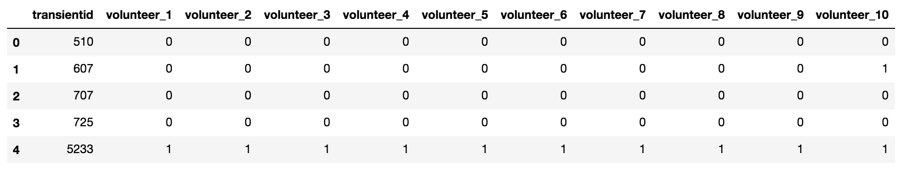

# Latent Class Model for labelling astronomical images

In this example we have a table with columns: transientid, volunteer_1... volunteer_10 as seen in the Figure below. 

The aim is to provide a final label to each transientid/candidate based on the volunteers labelling using Latent Class Model, instead of just assigning a label based on this criteria:
`P(Real) >= 0.5; label = 1 or P(real) < 0.5; label = 0.`

The core code on LCM is found in `lcm.py` and a demo is found in `DEMO - Latent class model for Bogus and Real Labelling.ipynb`
